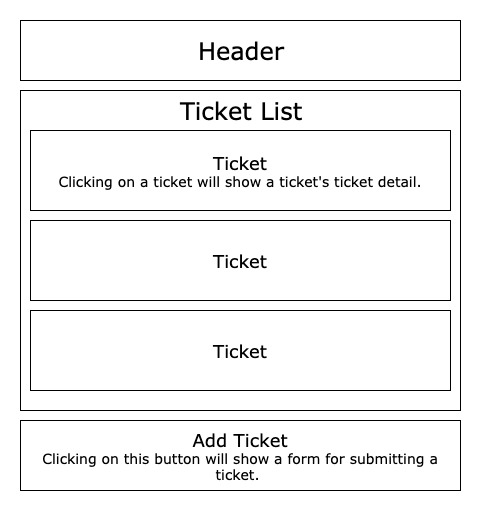
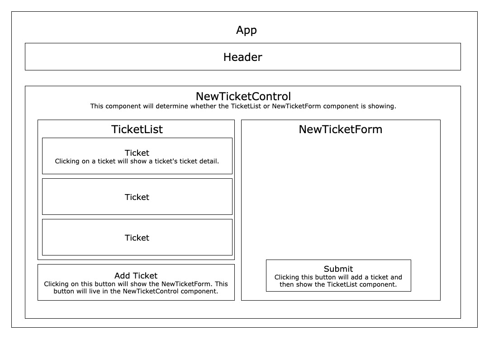
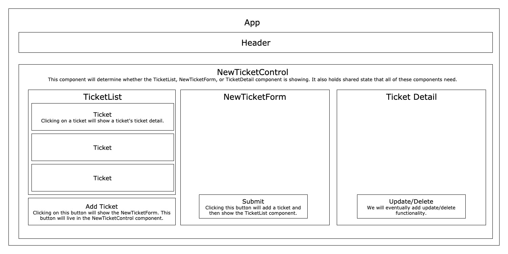

<div align=center>

# Help Queue

#### React Fundamentals & Redux Exercise for [Epicodus](https://www.epicodus.com/), 04.20.2020 - 04.26.2020

#### By **Adela Darmansyah**

[Sample Component Diagrams](#Sample-Component-Diagram) | [Notes on React](#Notes-on-React) | [Hooks](#Hooks) | [Notes on Redux](#Notes-on-Redux) | [React-Redux](#React-Redux) | [Testing with Jest](#Testing-with-Jest) | [Component Life Cycle Methods](#Component-Life-Cycle-Methods) | [Notes on Firebase](#Notes-on-Firebase) | [About NoSQL](#About-NoSQL) | [ACID vs BASE](#ACID-vs-BASE) | [The CAP Theorem](#The-CAP-Theorem)

  

</div>

## Sample Component Diagrams

Initial component diagram:



Version 2.0:



Version 3.0:



## Notes on React

### What is React?

* At its core, it's a JavaScript **library** for developing the view layer. A library focuses on one piece of functionality and that's exactly what React does. It isn't concerned with the back-end of an application. Instead, it manages how user interfaces look and behave.

* React is also **highly dynamic**. This means it can handle views that need to change a lot. React allows us to quickly and dynamically update the UI without reloading pages. Any application or site that requires frequent updates is a great candidate for React

### Why use React?

* **Component-Based** - which assists in organizing even the most complex user interfaces into small packages of dedicated functionality. We can also reuse components to keep projects organized and DRY.

* **Declarative** - declarative programming is when we write code that describes the intended end result instead of writing every single step required to reach that result. This saves us time and is also easier to read and understand.

* **Data Model Synchronization** - updating user interfaces to reflect changing application data is one of the most difficult challenges that web developers face on a day-to-day basis. React includes built-in functionality to automatically synchronize our data models with our user interface. That means when we update a piece of data in our application (called `state`), we can code our user interface to automatically update to reflect that change.

* **The Efficient Virtual DOM** - allows us to interact with the DOM more efficiently and with much less code than other libraries and frameworks.

* **Easier to Create Single Page Applications** - for example, Facebook, Gmail, Instagram, Twitter are single-page apps.

* **JSX** - allows developers to mix HTML with JavaScript. While not mandatory, developers report that JSX makes developing in React much easier. Nearly all React applications use JSX syntax.

* **Support** - Facebook and Instagram maintain React. These are large, established companies with the resources to support and maintain React (and its documentation) into the foreseeable future. Our applications will be more stable if we use well-supported tools.

* **Library Benefits** - Because React is just a view library, developers have tremendous flexibility to build out other parts of their applications as they see fit.

* **React Native and VR** - React developers can also explore building mobile-friendly applications with React Native. Both React and React Native follow the same design patterns. React is also developing React VR, a framework for building interactive virtual reality apps using React and JavaScript. Once you have a strong foundation in React, you'll be that much more prepared to build mobile-friendly and virtual reality applications.

### The Virtual DOM

1. **React Creates its own Virtual DOM
React is declarative**, which means we only need to declare what our UI should like. React will handle the rest. When we create React elements (such as a header or paragraph), we're actually creating new elements in the virtual DOM, not the real DOM. Creating and updating this virtual DOM is much faster than updating the actual DOM because it doesn't require communication with the browser.

2. **React Compares the "Actual" DOM to its Virtual DOM.**
After crafting its own virtual DOM, React then compares it to the "actual" DOM in the browser, noting any differences between the two.

3. **React Calculates Changes.** React then automatically calculates the least number of changes necessary to update the actual DOM to match its virtual DOM. This process is known as reconciliation.

4. **React Updates Actual DOM.** React then updates the real DOM to match the virtual DOM only once. This is much faster than calling the DOM multiple times, making each small change individually.

5. **Repeat.** This process repeats as the user interacts with the application. React continues to update its own virtual DOM as users complete actions that warrant updates to the user interface. While it's important to have a basic understanding of how the virtual DOM works, React will take care of the heavy lifting for us and allow us to create very efficient sites with relatively little code.

### Several key points of **React Components**:

* **Functional components** are literally functions that returns a React element. They can't store or alter state. We will mostly write functional components.

* **Class components** are classes that extend React's Component class. They **must** always include a `render()` method that will return a React element. _They are used when we need state._

* **Nesting components** is a big part of developing with React. Components can be parents, siblings, children or any combination thereof.

* Small, **modular components** are the way to go. This makes our code easier to understand and allows us to separate presentational concerns.

### More on React Components:

* Storing all components in a `components` directory is considered a best practice. However, note that index.js should not be added to our new `components` directory.

* Note that `Header.js` is capitalized. It is standard naming convention to capitalize component names.

* Generally, we will want our state to live in one place and be _the single source of truth_. Instead of each `Ticket.js` storing its own data (which wouldn't be a single source of truth), we'll have a parent component store all of the ticket data - that way, our state will be stored in one place.

### Props

* React components accept properties (known as **props**) passed down from a parent. Because React components are functions, these props are actually just a special kind of argument.

* **Props Are Read-Only.** React components aren't just functions - they are _pure functions_. As we know from our functional programming week, pure functions don't have side effects and don't alter state. We need to follow these same rules when we are working with props. We will **never alter the value of props** because this would alter the state of our application and break a cardinal rule of pure functions: no side effects. For that reason, it's very important to remember that **props are read-only.**

* **Avoid props drilling!** The more components that have to pass down props, the more places our application could break down.

### Suggested Guidelines when using CSS

* Use extreme caution when using external stylesheets with React. Here are the suggested guidelines:

  * If your application will have any global style rules, put them in `index.css`.
  * If you plan to use stylesheets for individual components (_which we don't recommend_), make sure that classes and ids very specifically to pinpoint elements in that component.
  * Some animations and pseudo class selectors (like `hover`) can't be implemented with recommended practices like CSS objects - so stylesheets may be an acceptable option in these use cases.

### State VS Component

* State is something that can potentially change. In contrast, a component _cannot_ change its props. **State is fluid and ever-changing while props are not.**

* **As a rule, we should only define a component as a class if it absolutely requires state.**

* **If a component does not require state, it should be a stateless functional component.**

* **Avoiding unnecessary use of state is an important rule in React.**

### States

* **State** is anything in an application that we need to store and change.

* For instance, in our help queue, each time we add a new ticket, we need to update the application's state to hold the new ticket. Likewise, we'd need to update the application's state to edit or delete a ticket.

* **Local State** - lives in a _single_ component and is never used in other components.

  * Conditional rendering is a great example of local state and it's very common in dynamic applications. **Conditional rendering** - using a conditional to determine what content should be rendered. 

* **Shared State** - is shared by _multiple_ components and can get complicated very quickly.

  * Where should a shared state live? **At the lowest common ancestor for all the components that need that state.**

* We can define any default state a component should have in the **constructor**. _It is the only place we should define default state in a pure React application._

* **Always use the `setState()` (an async) method to update state in a pure React application** so that the component will re-render (basically, let React does its job!)

  * `setState()` can optionally take two arguments. This is the actual first argument that `setState()` can take:
  
  `````
  (state, props) => stateChange
  `````

  * We can choose to just pass in an object (the stateChange), but we can also pass in an arrow function that takes the current state and props as arguments.

* There are plenty of use cases where we need to know about the current state. Here are some examples:

  * _We want to toggle a boolean._ That means we need to know the current state of the boolean so we can toggle it to its opposite state.

  * _We want to increment or decrement a value._ A prime example is a counter that we need to increment by one or some other value each time a button is clicked.

  * _We want to update the state of a game._ Let's say we are making a game where the location of pieces is constantly changing. We need to know the previous state to determine where pieces can move next.

### Unidirectional Data Flow

* Unidirectional data flow is a language-agnostic term for applications that have data flowing in only one direction.

* In the case of React applications, data can only flow from a parent component down to a child component.

* **It's the job of parent components to keep track of their children, not the other way around.**

* The same is true with props. We can only pass props down from a parent component to a child component.

* So if data can only be passed _down_, then how can we get information from a child component up to a parent component?

  * The answer: we need to use **callbacks**. Here's how it works:
    1. We define a method in a parent component that has state.
    2. The parent component passes this method into the child component as a prop. Functions can be props just like any other data type.
    3. We will add this method to a function in our child component in the form of a callback.
    4. When the child executes the function that contains the parent component's callback, the method in the parent component is invoked. Because the callback resides in the parent component, the parent component can access any data that's passed into it. This works similarly to a closure.
  
  * This may feel like we're breaking the rules of unidirectional data flow because the parent component can access information from the callback executed in the child component. However, that's not the case. The parent component passes props down using unidirectional data flow. If a function is passed downward as a prop, the parent can still access it.

  * It's common practice to _prefix_ the name of an _event handler function_ with `handle`. Any _props_ containing that function will be _prefixed_ with `on`. This is because the prop will be used when the event occurs, but the function itself is what actually handles the necessary actions. It also ensures the names are similar enough to easily determine which props and functions correspond, yet different enough to determine when we're referencing a function and when we're referencing a prop containing a function.

## Hooks

**Hooks** let you use state and other React features without writing a class. A hook is simply a way to "hook" a piece of state to a functional component.

#### Basic React Hooks

##### `useState()`

> `````
> const [state, setState] = useState(initialState);
> `````

* Returns:
  1. A stateful value
  2. A function to update #1

* During the initial render, the returned state (`state`) is the same as the value passed as the first argument (`initialState`).

* The `setState` function is used to update the state.
    > `````
    > setState(newState);
    > `````
    * Argument:
        1. A new state value
    * The function will then enqueue a re-render of the component.

#### React Redux Firebase Hooks

##### `useFireStoreConnect()`

A React hook that automatically listens/unlistens to provided Cloud Firestore paths. Examples:

> `````
>  useFirestoreConnect('todos')
>// sync todos collection from Firestore into redux
> `````

> `````
> useFirestoreConnect([{
>    collection: 'todos',
>    doc: todoId
>  }])
> // use object as query
> // doc: todoId specifies to listen to changes to a document with an id of todoId from the todos collection
> `````

Arguments:
  1. `queriesConfigs` (object/string/array of object or string/function that returns object/string/array of object or string)

Make sure the Cloud Firestore is imported including its reducer before attempting to use.


## Notes on Redux

### What is Redux?

* **Redux** is a library that we can use to manage shared state in React applications. Their goal is to simplify managing complex state.

* Note that `create-react-app` does not come with Redux. This makes sense - Redux is a separate state management library and smaller React applications won't need it.

* From the very beginning, Redux doc stresses that _Redux has no relation to React_. You can write Redux apps with React, Angular, Ember, jQuery, or vanilla JavaScript.

* That said, Redux works especially well with libraries like React and Deku because they let you describe UI as a function of state, and Redux emits state updates in response to actions.

### Three Principles of Redux:

1. **Single Source of Truth**
    
    * The `state` of your whole application is stored in an `object tree` within a single `store`.

    * An **object tree** (aka **state tree**) is _a big object_ that can contain multiple `state slices`.

    * A **store** is an _object_ that holds the application's state tree. The store acts as the **"single source of truth"** for the whole app. There should only be a single store in a Redux app, as the composition happens on the reducer level.

    * `getState()` returns the _current_ state of the store.

    * Benefits:

      * Easy to create universal apps, as the state from your server can be serialized and hydrated into the client with no extra coding effort.

      * Easier to debug or inspect an application because of the single state tree.

      * Faster development cycle also due to the single state tree.

2. **State is Read-Only**
    
    * **We cannot modify state directly.**

    * The only way to change the state is to emit an `action`, an object describing what happened.

    * An **action** is a plain object that represents an intention to change the state. Actions are the only way to get data into the store.

      * _We won't use `setState()` to update state with Redux._

    * Benefits:
    
      * Ensures that neither the views nor the network callbacks will ever write directly to the state. Instead, they express an intent to transform the state.

      * Because all changes are centralized and happen one by one in a strict order, there are no subtle race conditions to watch out for.
      
      * As actions are just plain objects, they can be logged, serialized, stored, and later replayed for debugging or testing purposes.

3. **Changes are Made with Pure Functions**
    
    * To specify how the state tree is transformed by actions, you write _pure_ `reducers`.
    
    * **Reducers** (aka **reducing functions**) are just pure functions that take the previous state and an action, and return the next state.

### Anatomy of Redux

#### Stores

* A **store** is an _object_ that holds the application's `state tree`.

* The store acts as the **"single source of truth"** for the whole app.

* **There should only be a single store in a Redux app**, as the composition happens on the reducer level.

* `createStore(reducer, preloadedState)`
  * A **store creator** is a function that creates a Redux store.
  * Takes in 1-2 Arguments:
    1. `reducer` (Function)
    2. `preloadedState`

* `getState()` 
  * Gets the current state of the store.
  * Per Redux doc: Returns the _current_ `state tree` of the `store`.
  * It is equal to the last value returned by the store's reducer.
  * Returns:
    * (any): The current state tree of your application.

* `dispatch(action)`
  * Sends an action to the store.
  * Per Redux doc: Dispatches an action. This is the only way to trigger a state change.
  * Takes in 1 Argument:
    1. `action` (Object):  A _plain object_ describing the change that makes sense for your application.
  * Returns:
    * (Object): The dispatched action.

* `subscribe(listener)`
  * To add change listeners to the store.
  * Per Redux doc: Registers a function to be called on state changes.
  * In other words, it _adds a change listener_.
  * Takes in 1 Argument:
    1. `listener` (Function): The _callback_ to be invoked any time an action has been dispatched, and the state tree might have changed. You may call `getState()` inside this callback to read the current state tree.
  * Returns:
    * (Function): A function that unsubscribes the change listener.

* `unsubscribe()`
  * To stop change listeners listening to changes.
  * Per Redux doc: To unsubscribe the change listener, invoke the function returned by `subscribe()`. Example:
    > ````
    > const unsubscribe = store.subscribe(doThisHandlerWhenAChangeHappens)
    > unsubscribe()
    > ````
  * Returns:
    * (Function): A function that unsubscribes the change listener.

* `replaceReducer(nextReducer)`
  * Per Redux doc: Replaces the reducer currently used by the store to calculate the state.
  * It is an advanced API. It can be used to implement hot reloading and code splitting. _Most likely you won't use it._

#### Reducers

* **Reducers** (aka **reducing functions**) are just pure functions that take the previous state and an action, and return the next state.

* The **parameters** of a reducer generally look something like this:
    > ````
    > (state = {}, action)
    > ````

* All a reducer cares about is taking a thing, applying an action to a copy of that thing, and then returning the altered copy. It doesn't know anything else about our application such as how state will be stored or applied in the UI. **Never use a reducer for side effects!**

* Per Redux documentation: A reducer (also called a reducing function) is a function that **accepts an accumulation and a value** and **returns a new accumulation**. They are used _to reduce a collection of values down to a single value_.

    > ````
    > type Reducer<S, A> = (state: S, action: A) => S
    > ````

* A Redux reducer is similar to JavaScript's built-in API for reducting: `Array.prototype.reduce()`. Therefore reducers are not unique to Redux.

* In Redux, **the accumulated value is the `state object`**, and **the values being accumulated are `actions`**.

* _Reducers calculate a new state given the previous state and an action._ **They must be pure functions—functions** that return the exact same output for given inputs and to be free of side-effects. This is what enables exciting features like hot reloading and time travel.

* _**Do not put API calls into reducers!**_

* `combineReducers(reducers)`

  * A **Root Reducer** handles the work of combining our application's reducers.

  *  **The state produced by `combineReducers()` namespaces the states of each reducer under their keys as passed to `combineReducers()`**

  * Arguments:

    1. `reducers` (Object): An object whose values correspond to different reducing functions that need to be combined into one. Any reducer passed to `combineReducers` must satisfy these rules:
        * **For any _action that is not recognized_, it must return the state given to it as the first argument.**
        * **It must never return undefined**. It is too easy to do this by mistake via an early return statement, so combineReducers throws if you do that instead of letting the error manifest itself somewhere else.
        * **If the state given to it is undefined, it must return the initial state for this specific reducer.** According to the previous rule, the initial state must not be undefined either. It is handy to specify it with ES6 optional arguments syntax, but you can also explicitly check the first argument for being undefined.

  * Returns:

    * (Function): A **reducer** that invokes every reducer inside the reducers object, and constructs a state object with the same shape.

#### Actions

* An **action** is a _plain object_ that represents an _intention_ to change the state.

* **Actions are the only way to get data into the store.**

* _We won't use `setState()` to update state with Redux._

* Any data, whether from UI events, network callbacks, or other sources such as WebSockets needs to eventually be dispatched as actions.

* Actions are objects that describe something that happened. They're _dispatched_ to the Redux store and handled by _reducers_. The reducer receives the action and executes logic based on the action's _type_ that alters state. Data included with the action is called a **payload**.

* Naming convention for Redux Actions: capitalize actions and separate words with an underscore.

## React Redux

* Add `Redux` and `React Redux` bindings to your project by running the following command:
  > `npm install redux@4.0.5 react-redux@7.1.3`

### Features and Functionality

* The `<Provider>` component
* The `connect()` function
* The `dispatch()` function
* The `mapStateToProps()` function

#### `<Provider>` Component

* The `<Provider />` makes the Redux store available to any nested components that have been wrapped in the `connect()` function.

* In other words, **the `<Provider>` component will give all of its child components access to the `connect()` function**, which is needed to connect to the Redux store.

* Since any React component in a React Redux app can be connected, most applications will render a `<Provider>`_at the top level_, with the entire app’s component tree inside of it.

* Normally, you can’t use a connected component unless it is nested inside of a `<Provider>`.

#### `connect()`

* The `connect()` function **connects a _React_ component to a _Redux_ store.**

* Acts as an intermediary between a REACT component and the REDUX store.

* A **higher-order component** - a function that takes an existing component, wraps it with additional functionality, and then returns it so it can be used elsewhere in an application. In other words, **a HOC takes a component and returns a new component.**

* It provides its connected component with the pieces of the data it needs from the store, and the functions it can use to dispatch actions to the store.

* It does not modify the component class passed to it; instead, it returns a new, connected component class that wraps the component you passed in.

* Optional Parameters:
  1. mapStateToProps?: Function
  2. mapDispatchToProps?: Function | Object
  3. mergeProps?: Function
  4. options?: Object

* `mapStateToProps(state)`

    * This function takes a state slice from the REDUX store and then maps it to a prop in the REACT component.

    > `````
    > const mapStateToProps = state => {
    >   return {
    >     // Key-value pairs of state to be mapped from Redux to React component go here.
    >   }
    > }
    > `````

    * Up to 2 Parameters:
      1. `state`: Object
      2. `ownProps?`: Object
    
    * Returns:
      * An object.
      * This object, normally referred to as `stateProps`, will be merged as props to your connected component.

## Testing with Jest

### Smoke Tests

* A **smoke test** is just a simple test to ensure the basic functionality works. It isn't comprehensive testing, but it will get the job done.

## Component Life Cycle Methods

* **The React lifecycle** is _a series of methods_ that is always called in a certain order.

* We can use these lifecycle methods to call our own methods _at a very specific time_ during a component's lifecycle.

### The 3 Stages of React's Component LifeCycle:

1. **Mounting** refers to the stages where a component is instantiated and then added to the DOM. It includes the following common lifecycle methods, which are called in order:
    * `constructor()`: This is where we specify any properties the component should have such as local state.
    * `render()`: The only lifecycle method that's required in a class component.
    * `componentDidMount()`: Invoked after a component has finished inserting all DOM nodes. The React documentation recommends setting up subscriptions during this lifecycle method.

2. **Updating** is a stage that can happen multiple times during a component's lifecycle. For example, this stage would occur each time a user increments a counter.
    * `render()`: gets called again so that any DOM nodes that have changed can be refreshed.
    * `componentDidUpdate()`: If we have a method that we want to call any time the component updates, we could do so here.

3. **Unmounting** occurs when the component is being removed from the DOM. It only has one method:
    * `componentWillUnmount()`: Can be used to perform any cleanup such as unsubscribing or canceling a timer.

## Notes on Firebase

* What is **Firebase**?
  * A **realtime, cloud-based NoSQL database solution** offered by Google.
  * **Cloud-based** means it exists online, or "in the cloud." 
  * **Realtime** means we can see database changes immediately in our online dashboard.
  * Firebase realtime database stores all data in a large JSON object. _Downside_: it's more difficult to query this database.
  * Therefore we will use **Firebase as our BaaS and Firestore as our database solution.**
    * **Firestore** is another realtime cloud-based database solution provided and recommended for users by Firebase.

* A **BaaS** (**Backend-as-a-Service**). Other examples of BaaS:
  * AWS
  * Appcelerator
  * Cloudmine
  * Auth0
  * Backendless

* **Benefits of BaaS**:
  * Decreased development time.
  * Smaller learning curve.
  * Scaleability. (In case our app became popular overnight, big services like Firebase/AWS are already designed to handle high traffic therefore experiencing less issues)
  * Multiple features in one.

* **Drawbacks of BaaS**:
  * Lack of control. (If another service writes your back end, you can only make customizations the service allows)
  * Cost.
  * Stability. (You may risk losing your backend if a BaaS provider closes doors)

## About NoSQL

* NoSQL is designed to handle massive stores of data better than SQL so NoSQL is preferred in larger companies.

### SQL vs. NoSQL:

  | SQL | NoSQL |
  | :-- | :---- |
  | Relational	| Non-relational | 
  | Uses a Schema | 	No Schema | 
  | Uses SQL (structured query language) | Doesn't use a declarative query language | 
  | Great for complex queries |	Not built for complex queries | 
  | ACID approach |	BASE approach | 

## ACID vs BASE

### ACID

* Transaction (a document is sent to a printer)
* **Atomic** (prints an entire document or nothing at all)
* **Consistent** (printer prints half page and the page gets stuck. The printer restarts itself and prints 2 pages with all content)
* **Isolation** (while there were too many print outs in progress, the printer prints the right content of the document)
* **Durable** (while printing, there was a power out. The printer again will print documents without any errors.)

### BASE

#### Basically Available (to new relationships)

The system guarantees availability (in terms of the CAP theorem).

#### Soft state (none of his relationships last very long)

The state of the system may change over time, even without input. This is because of the eventual consistency model.

#### Eventual consistency (one day he _will_ get married)

The system will become consistent over time, given that the system does not receive input during that time.

## The CAP Theorem

The CAP theorem by Eric Brewer argues that a database system can use **at most** two of its three principles. For instance, in order to get both availability and partition tolerance (AP), you have you give up consistency (C).

### Consistency

Data is the same across the cluster so you can read/write from/to any node and get the same data.

### Availability

The ability to access the cluster even if a node in the cluster goes down.

### Partition Tolerance

The cluster continues to function even if there is a "partition" (communication break) between two nodes (both nodes are up but can't communicate).

### All available combinations are:

#### CA
Data is consistent between all nodes - as long as all nodes are online - and you can read/write from any node and be sure that the data is the same. But if you ever develop a partition between nodes, the data will be out of sync (and won't re-sync once the partition is resolved).
Note that CA systems don't practically exist (even if some systems claim to be so) - refer to stackoverflow.

#### CP
Data is consistent between all nodes, and maintains partition tolerance (preventing data desync) by becoming unavailable when a node goes down.

#### AP
Nodes remain online even if they can't communicate with each other and will resync data once the partition is resolved, but you aren't guaranteed that all nodes will have the same data (either during or after the partition).


<details>

  <summary>README content generated by Create React App</summary>

  This project was bootstrapped with [Create React App](https://github.com/facebook/create-react-app).

  ## Available Scripts

  In the project directory, you can run:

  ### `npm start`

  Runs the app in the development mode.<br />
  Open [http://localhost:3000](http://localhost:3000) to view it in the browser.

  The page will reload if you make edits.<br />
  You will also see any lint errors in the console.

  ### `npm test`

  Launches the test runner in the interactive watch mode.<br />
  See the section about [running tests](https://facebook.github.io/create-react-app/docs/running-tests) for more information.

  ### `npm run build`

  Builds the app for production to the `build` folder.<br />
  It correctly bundles React in production mode and optimizes the build for the best performance.

  The build is minified and the filenames include the hashes.<br />
  Your app is ready to be deployed!

  See the section about [deployment](https://facebook.github.io/create-react-app/docs/deployment) for more information.

  ### `npm run eject`

  **Note: this is a one-way operation. Once you `eject`, you can’t go back!**

  If you aren’t satisfied with the build tool and configuration choices, you can `eject` at any time. This command will remove the single build dependency from your project.

  Instead, it will copy all the configuration files and the transitive dependencies (webpack, Babel, ESLint, etc) right into your project so you have full control over them. All of the commands except `eject` will still work, but they will point to the copied scripts so you can tweak them. At this point you’re on your own.

  You don’t have to ever use `eject`. The curated feature set is suitable for small and middle deployments, and you shouldn’t feel obligated to use this feature. However we understand that this tool wouldn’t be useful if you couldn’t customize it when you are ready for it.

  ## Learn More

  You can learn more in the [Create React App documentation](https://facebook.github.io/create-react-app/docs/getting-started).

  To learn React, check out the [React documentation](https://reactjs.org/).

  ### Code Splitting

  This section has moved here: https://facebook.github.io/create-react-app/docs/code-splitting

  ### Analyzing the Bundle Size

  This section has moved here: https://facebook.github.io/create-react-app/docs/analyzing-the-bundle-size

  ### Making a Progressive Web App

  This section has moved here: https://facebook.github.io/create-react-app/docs/making-a-progressive-web-app

  ### Advanced Configuration

  This section has moved here: https://facebook.github.io/create-react-app/docs/advanced-configuration

  ### Deployment

  This section has moved here: https://facebook.github.io/create-react-app/docs/deployment

  ### `npm run build` fails to minify

  This section has moved here: https://facebook.github.io/create-react-app/docs/troubleshooting#npm-run-build-fails-to-minify

</details>
